# Introduction

The goal of the project was to investigate the effects of electromagnetic fields at radio frequencies on plant germination. To create conditions for the study, a high-frequency signal generator is needed, as well as a device that will generate an electromagnetic field.

Despite a wide selection of antennas, we excluded their use.  
First and foremost, an antenna does not generate a uniform electromagnetic field.  
Moreover, it is a radiating element, so the radio signal emitted from the generator would be received outside the premises of the circle, thus causing interference to the licensed primary user (Primary User).

An interesting solution is the TEM line, which, when operating correctly, serves as a transmission line. An ideal transmission line does not radiate energy outward.

## TEM Line
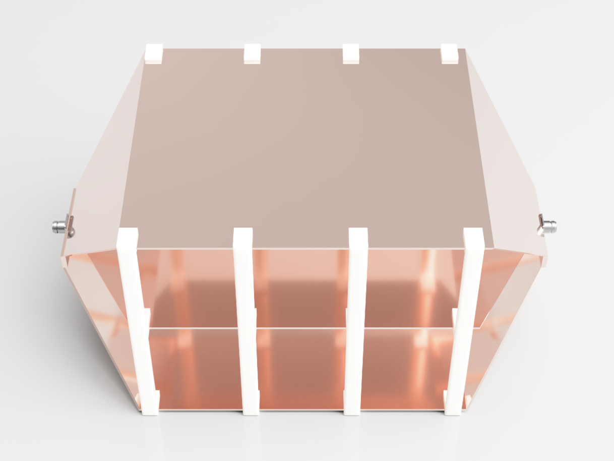

Photo x.x - Visualization of the TEM line  

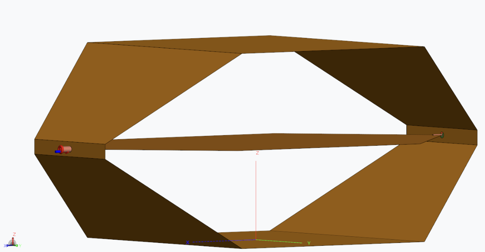
Photo x.x - TEM line in simulation software

The TEM line is connected at one end to a high-frequency signal source, and at the other end, it is connected to a load that matches the system's impedance - usually 50 ohms. Then, a quasi-uniform electric field appears between the two conductors constituting the TEM line. The TEM line is mainly used in electromagnetic compatibility studies - both in the investigation of disturbances generated by a device placed inside the line, as well as in studying the device's response to artificially generated disturbances.

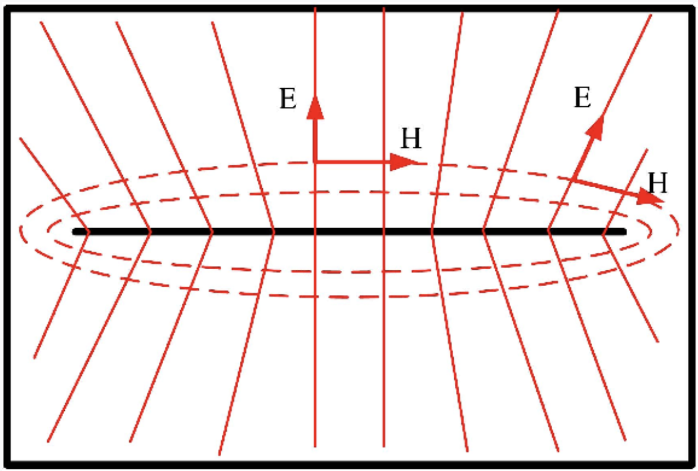
Photo x.x - Field distribution inside the TEM line  

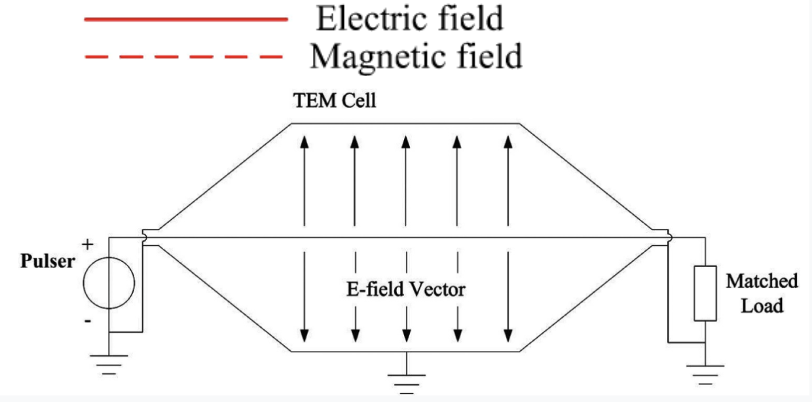
Photo x.x - Electric field inside the TEM line

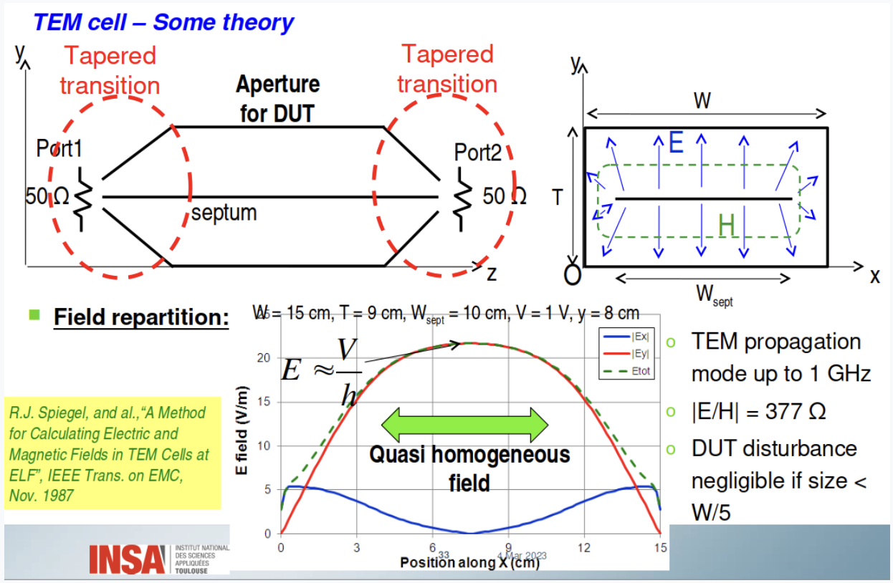
Photo x.x - Example of a quasi-uniform electric field in the TEM line

## Works Related to the Design of the TEM Line

As part of the project, a parameterized model of the TEM line was designed.  
Thanks to parameterization, it was possible to determine the optimal dimensions of the construction by performing a series of simulations for different sizes of the components.

Subsequently, we compared the key parameter, VSWR, and selected the sizes for which it is the smallest. We could then change the next dimensions and continue to observe VSWR. Thus, we iteratively arrived at the desired parameter.

VSWR stands for Voltage Standing Wave Ratio. It describes the ratio of the high-frequency power supplied to the input of the TEM line to the power reflected from it. It is given for both single-port elements (such as antennas) and two-port elements (such as filters, transmission lines). In the operating band, this coefficient should be as small as possible.

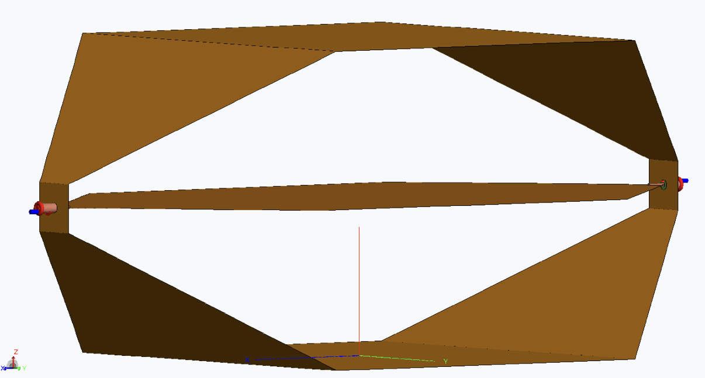
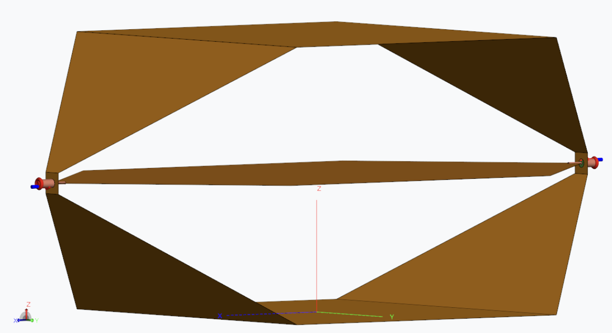
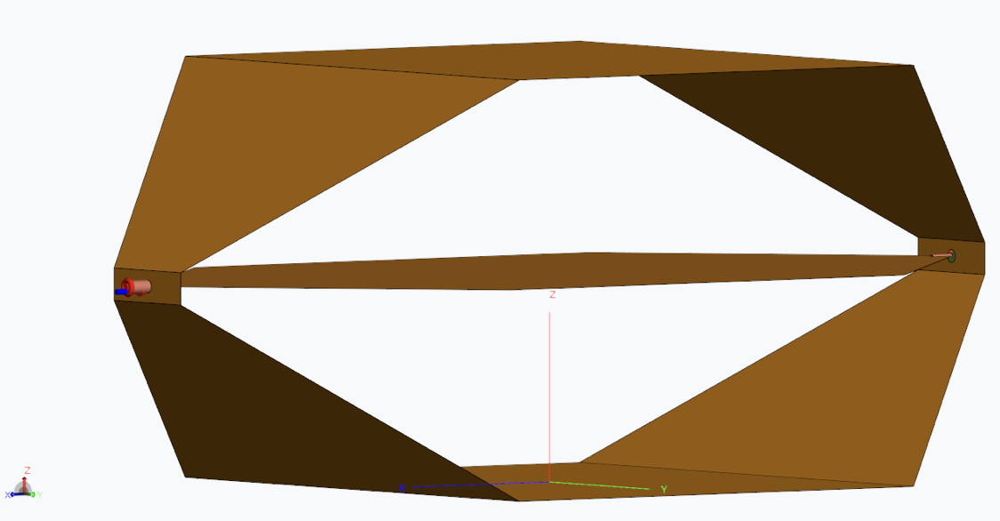
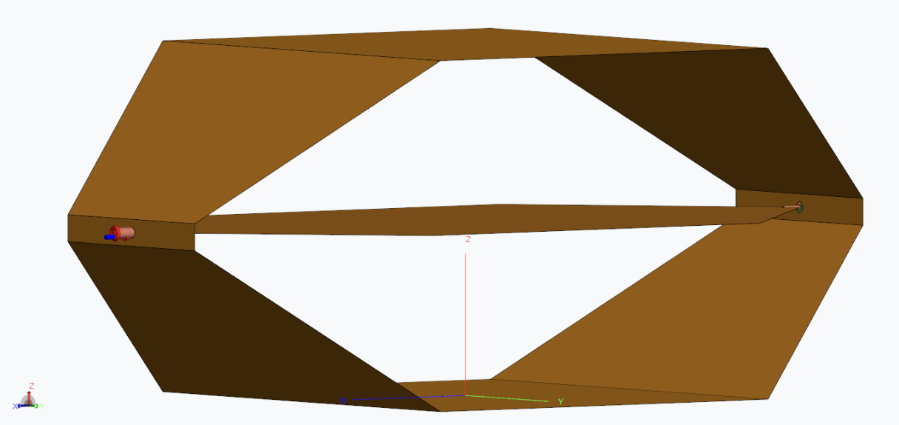

Photo x.x - As a result of a series of simulations, we transitioned from the first model (SWRmax = 3.5) to the fourth model (SWRmax = 1.65).

In the simulations, we also investigated the "gain" in dB for various radio frequencies that the designed TEM line (correctly loaded) would have if it were considered a radiating element.

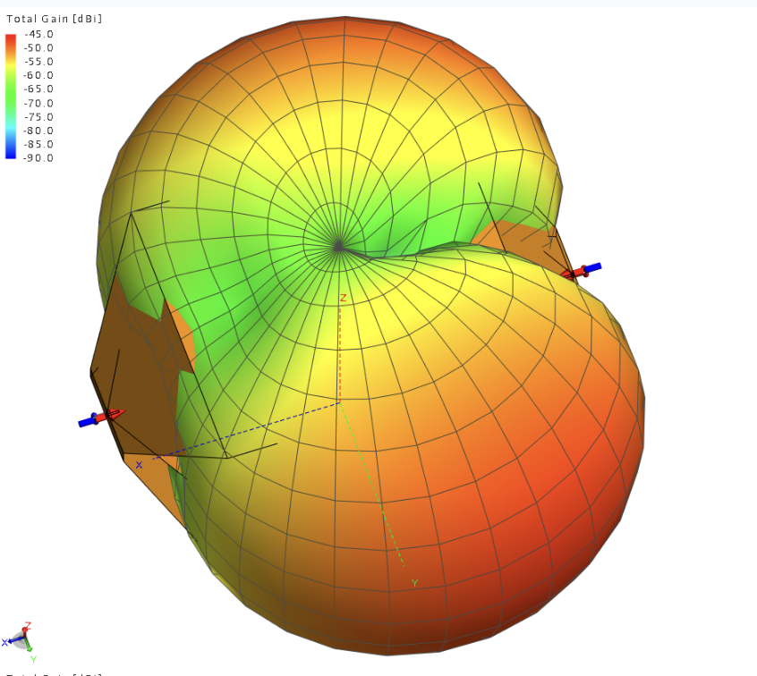
Photo x.x - Gain for 50MHz  

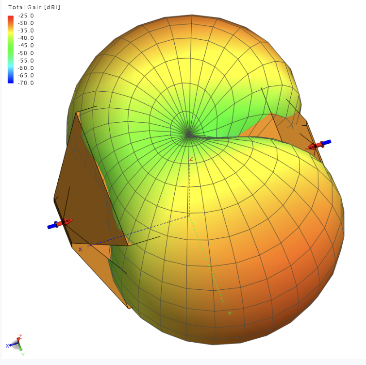
Photo x.x - Gain for 100MHz

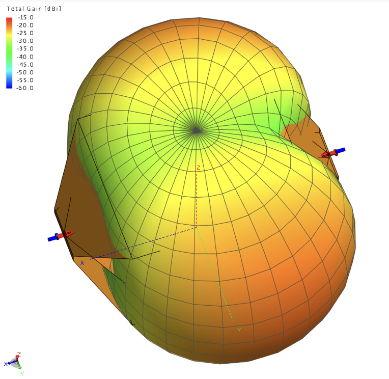
Photo x.x - Gain for 150MHz  

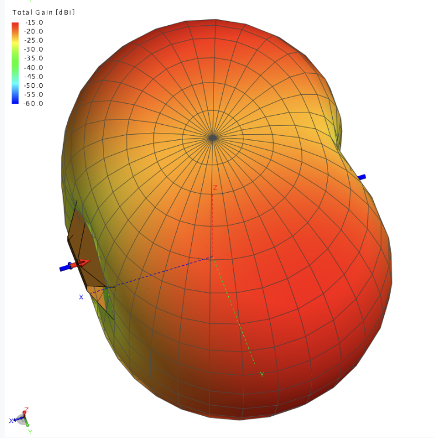
Photo x.x - Gain for 100MHz

Altair and Endego provided our student research group, Spectrum, with software for the project purposes.

## References:

<https://doi.org/10.1080/15368378.2020.1793170>

<https://www.semanticscholar.org/paper/The-optimization-design-of-septum-in-TEM-cells-for-Wen-Zhang/d5e2968a4299155fc24cbab97f3cd4ee851828f9/figure/1>

<https://slideplayer.com/slide/12980853/>
